<div align="center">

[English](README.md) · [Türkçe](README.tr.md) · **Русский**



<p>
  <a href="LICENSE"></a>
  <a href="https://github.com/Pulsariums/PAR/actions/workflows/ci.yml"></a>
  <a href="https://github.com/Pulsariums/PAR/actions/workflows/pages.yml"></a>
  
  
  
  
</p>

### [▶ Живая демо и песочница](https://pulsariums.github.io/PAR/)

**Рендерер субтитров ASS/SSA для браузера без зависимостей. DOM + SVG + CSS, без WebAssembly.**

</div>

PAR (Pulsar ASS Renderer) рисует субтитры Advanced SubStation Alpha (`.ass`) и SubStation Alpha (`.ssa`) поверх `<video>`
или любого контейнера. Достаточно передать элемент видео и исходный текст скрипта: размеры, поля letterbox, воспроизведение,
паузу и перемотку PAR отслеживает сам. Откройте [песочницу](https://pulsariums.github.io/PAR/), чтобы проверить каждый
поддерживаемый тег на встроенной тестовой таблице, на своём видеофайле или по ссылке, ничего не устанавливая.

## Возможности

| | |
|---|---|
| **Ноль зависимостей** | Около 30 КБ в gzip. Чистый TypeScript, никаких пакетов в рантайме и загрузки WASM. |
| **DOM, SVG и CSS** | Текст остаётся настоящим текстом, рисунки это SVG-контуры, буквы формирует собственный текстовый движок браузера. |
| **Подключил и работает** | `create({ video, subtitle })`. Letterbox, изменение размера, пауза и перемотка отслеживаются. |
| **Поведение как у libass** | Приоритет тегов, порядок `\t`, тайминг караоке и значения PlayRes по умолчанию повторяют libass (одно исключение: скрипты совсем без PlayRes по умолчанию получают 1920x1080; `defaultLayout: 'libass'` даёт 384x288). |
| **Детерминизм** | Одинаковый ввод, одинаковый результат. Идентификаторы строк берутся из порядка в файле, а не из случайных чисел. |
| **Частота кадров на ваш выбор** | Рисуйте на каждом кадре видео (`auto`) или ограничьте частоту от 10 до 200 fps; при желании привяжите время к fps видео. |
| **Область и разметка** | Видимая картинка видео, весь контейнер или любой прямоугольник; разрешение скрипта или любой виртуальный размер. |
| **Честные ограничения** | Каждый тег помечен: рисуется, приблизительно или не поддерживается (см. ниже). |

## Быстрый старт (30 секунд)

<details open>
<summary><b>ES-модуль / сборщик</b></summary>

```sh
npm install pulsar-ass-renderer
```

```js
import { create } from 'pulsar-ass-renderer';

const assText = await (await fetch('episode.ass')).text();
const par = create({ video: document.querySelector('video'), subtitle: assText });
```

> Пакета в npm пока нет. До выхода первого релиза соберите его из исходников (см. [Участие в проекте](CONTRIBUTING.md)).
</details>

<details>
<summary><b>Тег script (window.PAR)</b></summary>

```html
<script src="https://unpkg.com/pulsar-ass-renderer/dist/par.global.js"></script>
<script>
  const par = PAR.create({ video: document.querySelector('video'), subtitle: assText });
</script>
```
</details>

<details>
<summary><b>Без видео (контейнер и свои часы)</b></summary>

```js
const par = create({ container, subtitle: assText, clock: () => myPlayer.currentTime });

// или полностью вручную:
const still = create({ container, subtitle: assText });
still.renderAt(12.5); // секунды
```
</details>

Слой добавляется в родительский элемент видео (если у него `position: static`, он становится `relative`).

## Параметры

<details>
<summary><b>Все параметры</b></summary>

| Параметр | Тип | По умолчанию | Описание |
|---|---|---|---|
| `video` | `HTMLVideoElement` | - | Из него берутся время, пауза/перемотка и размер. |
| `container` | `HTMLElement` | `video.parentElement` | Элемент, в который добавляется слой; обязателен без видео. При `position: static` станет `relative` (`destroy()` вернёт как было). |
| `subtitle` | `string \| SubtitleSource` | - | Исходный текст `.ass` / `.ssa` или `SubtitleSource` для больших файлов (см. [Большие файлы](#большие-файлы-оконные-источники)). |
| `region` | `'video' \| 'container' \| {x,y,width,height}` | с видео `'video'`, иначе `'container'` | Где размещаются субтитры. `'video'`: видимая картинка видео (с учётом letterbox и `object-fit`). Прямоугольник задаётся в пикселях контейнера. |
| `layout` | `'script' \| {width,height}` | `'script'` | Виртуальное пространство координат. `'script'` = PlayRes скрипта (см. [Размер раскладки по умолчанию](#размер-раскладки-по-умолчанию-виртуальный-и-реальный)). Явный размер означает, что скрипт написан под него, и главнее всего остального. |
| `defaultLayout` | `'1080p' \| '720p' \| 'libass' \| {width,height}` | `'1080p'` | Виртуальный размер для скриптов совсем без PlayRes: 1920x1080, 1280x720, 384x288 как в libass или свой. |
| `windowSeconds` | `number` | `12` | Для `SubtitleSource`: сколько секунд событий держать в памяти (примерно 1/6 позади позиции, остальное впереди). |
| `fps` | `'auto' \| number` | `'auto'` | Частота отрисовки. `'auto'`: на каждый показанный кадр видео (`requestVideoFrameCallback`), иначе на каждый кадр экрана. Число от 10 до 200 задаёт потолок (выше частоты обновления экрана не поднимется). |
| `videoFps` | `number \| null` | `null` | Частота кадров исходного видео. Если задана, время привязывается к началу кадра. От `fps` не зависит. |
| `clock` | `() => number` | `video.currentTime` | Собственные часы в секундах. |
| `timeOffset` | `number` | `0` | Секунды, добавляемые к часам (задержка субтитров). |
| `fontMap` | `Record<string,string>` | `{}` | Имя шрифта ASS -> CSS `font-family`. Шрифты вы подключаете сами через `@font-face`. |
| `fonts` | `FontSpec[]` | `[]` | Шрифты для загрузки при создании (File, Blob, байты, URL или `{ source, family }`). См. [Шрифты](#шрифты). |
| `useLocalFonts` | `boolean` | `false` | Использовать установленные шрифты через Local Font Access API (Chromium, нужно разрешение). Не обязательно. |
| `embeddedFonts` | `boolean` | `true` | Загружать раздел `[Fonts]` скрипта. |
| `fontProviders` | `FontProvider[]` | `[]` | Асинхронные источники шрифтов (библиотека шрифтов, таблица URL, свои), опрашиваются по порядку для семейств, которые ничто раньше не покрыло. См. [Шрифты](#шрифты). |
| `providerTimeout` | `number` | `5000` | На один вызов провайдера, мс. Молчащий провайдер считается «не нашёл». |
| `onMissingFonts` | `(report, ctrl) => 'continue' \| 'wait' \| Promise` | нет | Решает, что делать при отсутствии шрифтов. По умолчанию: продолжить с запасными шрифтами. |
| `zIndex` | `number` | `1` | z-index слоя. |
| `renderMode` | `'auto' \| 'dom' \| 'canvas'` | `'auto'` | Как рисуются простые однобуквенные события (частицы караоке): `'auto'` = на canvas из кэшированных спрайтов, когда сцена тяжёлая, иначе DOM; `'dom'` = без canvas; `'canvas'` = всегда, когда событие подходит. См. [Тяжёлые сцены](#тяжёлые-сцены-караоке-oped). |
| `spriteCacheMB` | `number` | `96` | Лимит памяти кэша спрайтов canvas (дольше всех не использованные спрайты выбрасываются). |

Недопустимые значения вызывают исключение (`fps: 5` даёт `RangeError`, область нулевого размера даёт `TypeError`).
</details>

## API

<details>
<summary><b>Справочник</b></summary>

| Член | Описание |
|---|---|
| `create(options)` / `new PARRenderer(options)` | Создаёт рендерер и добавляет его слой. |
| `setSubtitle(text \| SubtitleSource \| null)` | Загружает или очищает субтитры. На повреждённом скрипте не бросает исключений (смотрите `script.warnings`). |
| `setOptions(patch)` | Меняет параметры на лету; меняются только переданные ключи. Смена `video`/`container` пересоздаёт слой. |
| `renderAt(seconds)` | Сразу рисует момент `seconds` (учитываются `timeOffset` и `videoFps`). |
| `refresh()` | Заново измеряет область и перерисовывает текущий момент. |
| `getMetrics()` | `{ region, layout, scaleX, scaleY, layoutSize, regionSize, scale, layoutSource, layoutDerived, time, activeLines, running }`: виртуальный размер, реальный размер, их отношение и откуда взят виртуальный. |
| `getSourceStats()` | `{ windowEvents, windowRange, loading, bytesRead, decodeMs, indexMs }` загруженного `SubtitleSource` (события в памяти, загруженный диапазон, прочитано байт, время декодирования). |
| `script` | Разобранный скрипт (`ParsedScript`) или `null`. Только для чтения. |
| `element` | Корневой элемент слоя. |
| `destroy()` | Удаляет слой, обработчики, наблюдатели и цикл. Дальнейшие вызовы бросают исключение. |

Также экспортируются чистые функции без DOM: `parseScript`, `parseText`, `parseBlock`, `parseTransition`, `lexOverrides`,
`parseDrawing`, `resolvePlayRes`, `fitRect`, `resolveRegion`, `resolveLayoutSize`, `stageTransform`, `VERSION` и все типы.

**Жизненный цикл.** С видео цикл работает только во время воспроизведения; пауза, перемотка, метаданные и смена размера дают один кадр.
С собственными часами и без видео цикл идёт постоянно (если время не изменилось, работы он не делает). Если нет ни того ни другого,
ничего не происходит, пока вы не вызовете `renderAt()`. Слой использует `pointer-events: none`, поэтому элементы управления видео работают.
</details>

## Размер раскладки по умолчанию (виртуальный и реальный)

Всегда участвуют два размера. **Виртуальный** (раскладочный) размер это пространство координат, в котором разложен скрипт: `\pos`, поля, размеры шрифтов и контуров это числа в нём. **Реальный** размер это область экрана, в которую рисуется результат, в CSS-пикселях. PAR масштабирует виртуальный кадр на реальную область (`масштаб = реальный / виртуальный`, по каждой оси).

Порядок выбора виртуального размера:

| Шаг | Источник | `getMetrics().layoutSource` |
|---|---|---|
| 1 | параметр `layout: { width, height }` | `'option'` |
| 2 | `PlayResX` **и** `PlayResY` скрипта | `'script'` |
| 3 | задана только одна сторона: другая выводится из пропорций показываемой области (16:9, если подходящей области нет); при `defaultLayout: 'libass'` вместо этого действует правило libass (только X: Y = X x 3/4, для 1280 получается 1024; только Y: X = Y x 4/3, для 1024 получается 1280) | `'script'`, `layoutDerived: true` |
| 4 | нет ни одной | `defaultLayout`: `'1080p'` (по умолчанию, 1920x1080), `'720p'` (1280x720), `'libass'` (384x288) или `{ width, height }` -> `'default'` |

`getMetrics()` сообщает оба мира: `layoutSize` (виртуальный), `regionSize` (реальный, CSS px), `scale` (`{ x, y }`, реальный / виртуальный), `layoutSource` и `layoutDerived` (прежние `layout`, `region`, `scaleX`, `scaleY` остаются).

**Что меняет значение по умолчанию.** Если в скрипте нет PlayRes, libass и VSFilter берут 384x288. По умолчанию PAR берёт 1920x1080: так считает большинство современных скриптов и плееров. Всё в скрипте это числа в виртуальном пространстве, поэтому именно оно определяет, насколько крупно всё выглядит: `Fontsize: 20` это 6,9 % высоты кадра при 384x288, но 1,9 % при 1920x1080; контуры, тени, поля и позиции масштабируются так же. Скрипт без PlayRes, написанный под libass, в умолчании PAR выглядит примерно в 3,75 раза мельче, чем в libass. Для строгой совместимости с libass используйте `defaultLayout: 'libass'`. Скрипты с PlayRes это не затрагивает.

## Время кадра: когда строка видна

Строка видна от своего начала **до конца, но конец не включается** (`startMs <= t < endMs`). Если одна строка кончается ровно там, где начинается следующая (`1.00` и `1.00`, очень частый случай), в этот момент первой уже нет, а вторая есть: никогда обе, никогда ни одной. Строка, у которой конец не позже начала, не видна никогда. Всё сравнивается в **целых миллисекундах**: время ASS это сотые доли секунды, а время медиа переводится один раз через `Math.round(t * 1000)` (как делает mpv перед вызовом libass), поэтому шум float вроде `0.1 + 0.2` не сдвинет границу. Времена `\fad`, `\t`, `\move` и караоке используют ту же целочисленную основу (мс от начала строки).

С `videoFps` время сначала привязывается к **началу своего кадра**: кадр `n` вычисляется ровно в `n / fps` (NTSC-частоты 23.976, 29.97, 59.94 это дроби 24000/1001, 30000/1001, 60000/1001, без накопления float), в мс переводится одним округлением. При 24 fps строка с началом `2.02` впервые видна на кадре `2.042 с`, а не на кадре `2.000 с`; строка с концом `1.00` на кадре `1.000 с` уже исчезла. `fps` (как часто PAR рисует) и `videoFps` (сетка кадров, к которой привязано время) независимы. Попробуйте пресет «Time boundaries» в песочнице и идите по кадрам в Lab.

## Большие файлы: оконные источники

`subtitle` принимает и `SubtitleSource`: тогда рендерер держит в памяти только скользящее окно событий (около 2 с позади и 10 с впереди, `windowSeconds: 12`), читает вперёд порциями, отменяет чтения, ставшие ненужными после перемотки, и для времени, события которого ещё не загружены, рисует **ничего** (а не неверные строки). Скрипт на 100 МБ играет, держа в памяти лишь несколько секунд.

```ts
import { create } from 'pulsar-ass-renderer';
import { fromAssFile, openSourceInWorker } from 'pulsar-ass-renderer/source';

const source = await openSourceInWorker(file, {            // File или Blob: .ass, .ssa, .xpar или .par (тип определяется по содержимому)
  worker: () => new Worker(new URL('pulsar-ass-renderer/worker', import.meta.url), { type: 'module' }),
  onProgress: (bytes, total) => bar.update(bytes / total), // индексация 100 МБ занимает несколько секунд
});
const par = create({ video, subtitle: source, windowSeconds: 12 });
par.getSourceStats(); // { windowEvents, windowRange: [от, до] | null, loading, bytesRead, decodeMs, indexMs }
```

Адаптеры (`pulsar-ass-renderer/source`): `fromAssText(text)` (экспортируется и из основного входа), `fromAssFile(blob)` (один потоковый проход строит небольшой временной индекс, окна читаются через `Blob.slice`; текст никогда не держится одной строкой), `fromXpar(blobOrUrl)` и `fromPar(...)` (читаются и распаковываются только блоки окна; для URL нужен HTTP Range), `openSource(blob)` (определяет тип) и `openSourceInWorker(blob, { worker })` (индексация и декодирование в Worker; без Worker остаётся поблочное асинхронное чтение в основном потоке). Чтобы подавать события откуда угодно, реализуйте `SubtitleSource` сами: `{ script, duration, eventCount, readWindow(t0, t1, signal?) }`; окна полуоткрыты по целым мс, события это структуры, которые выдаёт `parseScript` (те же id). Шрифты: стили задают начальный набор, шрифты из override добавляются по мере прихода окон, `[Fonts]` читается из источника (`fontSection()`); сценарий «шрифт отсутствует» работает без изменений.

## Тяжёлые сцены: караоке, OP/ED

В OP/ED на экране могут одновременно быть сотни частиц-букв (один символ, `\pos` / `\move`, `\blur`, `\c`, `\t`, `\frz`, `\fscx/y`, `\clip`, `\fad`). Один DOM-элемент с CSS-фильтрами на частицу этого не выдерживает, поэтому PAR рисует такие события на canvas: символ, контур, тень и размытие растрируются в спрайт **один раз** (белая маска, окрашиваемая под цвет; кэш по шрифту / символу / размеру / размытию с лимитом памяти), а в каждом кадре на событие приходится один `drawImage` с преобразованием; спрайты событий, которые вот-вот начнутся, строятся заранее в свободное время кадра. Всё более сложное (караоке `\k`, рисунки, 3D-поворот, скос, перенос или сталкивающийся текст) остаётся в DOM, как и всё остальное, если сцена лёгкая или в браузере нет фильтров canvas. Разница в пикселях с DOM на частицах на уровне шума; кадр, которому не хватило времени на спрайты, выходит без размытия и дорисовывается на следующем ходе, каждое такое решение считается в `getMetrics().render` (строки по путям, кэш спрайтов, `detailDropped`, `skipped`, время кадра p50/p95). Перемотка безопасна: устаревшее чтение отменяется, побеждает последняя перемотка. Числа и метод: [docs/performance.md](docs/performance.md).

## Студия

[Раздел Студия на сайте](https://pulsariums.github.io/PAR/#studio-root) это небольшой видеоплеер для ваших файлов (ничего не загружается на сервер): плеер (видео + слой PAR + управление) и медиаполка из трёх частей: **Видео** (mp4 / webm / mkv в пределах возможностей браузера; если не поддерживается, понятное сообщение), **Субтитры** (`.ass` / `.ssa` / `.xpar` / `.par`, с бейджем типа и размером) и **Шрифты** (постоянная библиотека `pulsar-ass-renderer/fontlib`, включая запрос об отсутствующих шрифтах). Добавление через выбор файлов или перетаскивание (несколько файлов). Видео и субтитры выбираются независимо: смена одного оставляет другое, позиция и состояние воспроизведения переносятся на новое видео. Под полкой **Экспорт PAR** (с потерями, выбор fps, по умолчанию определённый fps видео, иначе 24, `имя.<fps>fps.par`) и **Экспорт XPAR** (без потерь, `имя.xpar`) с прогрессом, отменой и размером относительно исходного ASS. XPAR / PAR повторно экспортировать нельзя (PAR потерял ASS): кнопки отключены с объяснением. На телефоне полки во вкладках под плеером. Код в `site/src/studio`, использует модули Lab.

## Lab

[Раздел Lab на сайте](https://pulsariums.github.io/PAR/#lab-root) открывает ваш `.ass` / `.ssa` / `.xpar` / `.par` (ничего не загружается на сервер): размер файла и статистика, реальный размер **XPAR** и размер **PAR** (с потерями) при выбранном fps (точно для маленьких файлов, для больших выборочная оценка с указанным разбросом, затем точный расчёт по запросу, с прогрессом и отменой; скачиваются `name.xpar` и `name.<fps>fps.par`), виртуальный и реальный размер с переключаемым умолчанием (1080p / 720p / libass 384x288 / свой) и переопределением, и плеер с шкалой, длина которой равна длительности субтитров: перемотка, шаги на кадр / 1 с / 5 с, предыдущая / следующая строка, скорость, цикл, fps отрисовки и fps видео, клавиши (Пробел или K, стрелки, Shift + стрелки, J / L, [ / ], Home / End) и живые числа окна и времени. Большие файлы индексируются и декодируются в Worker. `.par` с потерями: исходный ASS из него не восстановить, и он визуально равен оригиналу только на целевом fps.

## Шрифты

Скрипты называют шрифты, PAR заставляет браузер их использовать. Порядок разрешения имени ASS (ведущий `@` отбрасывается, регистр не важен): **загруженная гарнитура** (сначала пользовательская, затем встроенная) -> `fontMap` -> **гарнитура провайдера** (`fontProviders`) -> **установленный шрифт через `useLocalFonts`** -> системный шрифт -> общий `sans-serif` (помечается `missing`). Для жирного/курсива берётся настоящая гарнитура, если она загружена; иначе браузер рисует синтетически, и отчёт это показывает (правило libass: запрошенный вес > вес гарнитуры + 150).

```ts
const par = create({ video, subtitle, fonts: [fontFile] });   // File | Blob | ArrayBuffer | URL | .zip
await par.addFonts(input.files);     // пачкой; имя семейства читается из таблицы `name` (TTF, OTF, TTC, WOFF, WOFF2*)
await par.ready;                     // все загрузки шрифтов завершены, раскладка пересчитана
par.getFontReport();                 // { fonts: [{ name, status: 'embedded'|'user'|'provider'|'local'|'system'|'missing', styles, lines, ... }], missing, pending, warnings }
par.listFonts(); par.removeFont(id); par.onFontsChange(fn);
await par.loadLocalFonts();          // вызывать из клика: Local Font Access API, false если недоступно или отклонено
```

- **Встроенные шрифты**: раздел `[Fonts]` (uuencode SSA/ASS, несколько шрифтов, неполная последняя строка) декодируется и регистрируется в `document.fonts`. Одинаковые байты регистрируются один раз, со счётчиком ссылок на рендерер; `destroy()` освобождает их.
- **Время загрузки**: пока шрифты скрипта грузятся, текст не рисуется, затем строки пересобираются и измеряются с правильным шрифтом (без ожидания в каждом кадре).
- **Метрики**: libass задаёт `\fs` так, что `usWinAscent + usWinDescent` равно ему (прочитано в libass `ass_font.c`, `set_font_metrics` / `ass_face_set_size`). Для загруженных шрифтов PAR использует `font-size = fs * unitsPerEm / (winAscent + winDescent)` (запасные: hhea, typo, bbox, как в libass). Для системных шрифтов измеряется сумма `fontBoundingBox` ascent + descent на canvas (обычно по hhea, у шрифтов с разными win и hhea может отличаться от libass); без метрик остаётся прежний коэффициент 0.9. Попиксельно с реальным libass не сравнивалось.
- **Ограничения**: PAR не распространяет шрифты и не делает подмножества; встроенные шрифты приходят от автора скрипта, учитывайте лицензии. `[Graphics]` игнорируется. Браузеры грузят только первую гарнитуру TTC, поэтому PAR извлекает каждую. Для имени из WOFF2 нужен `DecompressionStream('brotli')` (иначе семейство берётся из имени файла; передайте `{ family }`). Шрифт регистрируется на всю страницу: два разных шрифта с одинаковыми семейством, весом и стилем конфликтуют. `queryLocalFonts` есть только в Chromium и в headless не проверялся. `\fe` и кодировки игнорируются.

### Провайдеры шрифтов, preflight и сценарий «шрифт отсутствует»

**Порядок разрешения** (ведущий `@` убирается, регистр не важен): шрифт пользователя -> встроенный `[Fonts]` -> `fontMap` -> **`fontProviders` (в порядке массива)** -> установленный шрифт из `useLocalFonts` -> системный шрифт -> общий запасной (`missing`). Начертание провайдера берётся, только если ничто раньше не покрывает имя; если нужен жирный, а у провайдера обычное, PAR запросит у провайдера жирный вариант.

```ts
import { create, createUrlProvider, preflightScript, createMissingFontsPrompt } from 'pulsar-ass-renderer';
import { FontLibrary } from 'pulsar-ass-renderer/fontlib';

const library = await FontLibrary.open();                       // собственное постоянное хранилище шрифтов пользователя (IndexedDB)
const par = create({
  video, subtitle,
  fontProviders: [library.asProvider(), createUrlProvider('cdn', { 'Open Sans': 'https://example.com/OpenSans.woff2' })],
  onMissingFonts: () => 'continue',                             // или 'wait' / Promise
});
par.on('missingfonts', (report) => showPrompt(report));          // срабатывает снова при смене набора отсутствующих (в т. ч. ok: true)

const report = await preflightScript(assText, { fontProviders: [library.asProvider()] });   // без рендерера и DOM
// { ok, resolved[], missing[], synthetic[], providerHits, missingGlyphs, warnings, stats }
await par.preflight();                  // то же для загруженного скрипта; par.preflight(другойТекст) заранее подгружает шрифты для него
```

- **Провайдер**: `{ name, has?(family), get(family, { weight, italic }) -> байты | Blob | URL | zip | null, subscribe?(fn) }`. Падающий, медленный (`providerTimeout`) или отдающий мусор провайдер даёт только предупреждение. `subscribe` позволяет провайдеру сообщить о новых шрифтах; иначе вызовите `par.refreshProviders()`. `createUrlProvider(имя, таблицаUrl | { manifest })` качает лениво, по одному разу на URL (действует CORS).
- **Preflight** сканирует секцию Style и каждый блок `{...}` (`\fn`, `\b`, `\i`, `\r`, `\p`; `\t(...)` шрифт менять не может) тем же лексером, что и рендерер, не строя события: память не растёт с размером скрипта. Вход: строка, итерируемый / асинхронно итерируемый набор строк, `linesFromChunks(stream)` для идущей загрузки; или только `usedFonts: ['Arial', { family, bold, italic }]`, если семейства известны иначе (`signal`, `onProgress` для огромных файлов). При потоковом чтении стили должны идти до событий (иначе будет предупреждение). `synthetic`: шрифты, где жирный/курсив будут имитированы; `missing`: шрифты, которых нет ни в одном источнике.
- **Недостающие глифы**: для шрифтов, которыми PAR владеет как начертанием (пользовательские, встроенные, от провайдера, локальные), используемые символы (`usedCharacters(текст)`: без тегов, `\N` `\h` и рисунков) сверяются с таблицей `cmap` (форматы 4 и 12): `report.missingGlyphs[family] = { count, sample }` (не более 64 кодовых точек в примере). Системные шрифты проверить нельзя. Это предупреждение, `ok` остаётся true.
- **Решение**: когда шрифты скрипта загрузились и каких-то нет, `onMissingFonts(report, ctrl)` вызывается один раз на скрипт. `'continue'` (по умолчанию) рисует запасным шрифтом. `'wait'` или ожидающий Promise удерживает каждое событие с отсутствующим семейством (остальные рисуются) до `ctrl.continue()` / `par.continueWithMissing()` или появления шрифтов. Исключение / отказ = продолжить. `par.ready` завершается, когда вся работа со шрифтами сделана и обработчик *вызван*; человека он не ждёт.
- **Помощник-подсказка** (необязательный, без CSS, не модальный): `createMissingFontsPrompt(container, report, { onContinue, onAddFonts, texts })` рисует «Шрифт X отсутствует. Продолжить? [Продолжить] [Добавить шрифт]» как `alertdialog` с настоящими, всегда видимыми кнопками; Escape закрывает; тексты ваши (i18n).
- **Библиотека шрифтов** (`pulsar-ass-renderer/fontlib`, отдельный вход ~11 кБ gzip, ядро его не импортирует): `FontLibrary.open(имя = 'par-fonts')`, `add(файлы | zip)` (дедупликация по SHA-256), `list()` (только метаданные, байты читаются лениво), `lookup(имя)` / `find(имя, weight, italic)` по семейству, полному имени, PostScript-имени или алиасу (без учёта регистра, `@` игнорируется), `remove(ids)`, `setAliases(id, имена)`, `coverage(id)`, `usage()` + `requestPersistence()` (`navigator.storage`), `exportZip()`, `repair()`, `onChange(fn)`, `asProvider()`. Помощники для UI: `scriptBadges` (латиница, расширенная латиница с турецким / азербайджанским, кириллица, греческий, хирагана, катакана, выборка кандзи, символы), `blockStats`, `sliceCps`. Вкладка шрифтов в playground — полный пример (предпросмотр, постраничная сетка символов, группировка, поиск, массовое удаление).
- **Юридическая / продуктовая заметка**: PAR не хранит и не распространяет шрифты, общего хостинга шрифтов нет. Библиотека — собственное локальное хранилище пользователя; шрифты не покидают устройство, если это не делает само приложение. Соблюдайте лицензии шрифтов.
- **Ограничения**: начертания провайдера остаются зарегистрированными до смены списка провайдеров или уничтожения рендерера; у схемы одна версия (механизм миграций есть, миграций пока нет); `exportZip` без сжатия и не переносит алиасы обратно; Safari может удалить IndexedDB без `persist()`; проверка глифов использует только `cmap` (без GSUB и подстановки); WOFF2 для имён требует Brotli.

## Поддерживаемые теги

Статусы совпадают с таблицей проверки возможностей в песочнице: каждая её строка загружает пример, который можно проверить глазами.
**Рисуется**: тег отрисовывается в DOM. **Приблизительно**: отрисовывается, но известным образом отличается от libass. **Не поддерживается**: не рисуется.

<details open>
<summary><b>Таблица поддержки тегов</b></summary>

| Тег / возможность | Статус | Примечания |
|---|---|---|
| `\pos` `\move(x1,y1,x2,y2[,t1,t2])` | Рисуется | Действует первый `\pos`/`\move` строки (как в libass); `\move` меняет местами перевёрнутые `t1`/`t2`. |
| `\an` `\a` | Рисуется | Действует первый, даже если он неверный (тогда остаётся выравнивание стиля); устаревший `\a` преобразуется (`\a4`/`\a8` как `\a5`). |
| `\org` `\frx` `\fry` `\frz` `\fr` | Рисуется | 3D с фиксированной перспективой; `\org` по умолчанию равен точке привязки. |
| `\fad` `\fade` | Рисуется | Прозрачность строки, действует первый. |
| `\clip` `\iclip` (прямоугольник) | Рисуется | CSS `clip-path` на всё событие, в координатах скрипта (не следует за `\pos`/`\move`/поворотом). Действует последний; углы не переставляются (пустой прямоугольник скрывает строку, как в libass); анимируется через `\t` от всей области скрипта. Края сглажены (libass режет по целым пикселям). |
| `\clip` `\iclip` (вектор, с масштабом) | Рисуется | Действует первая векторная обрезка, вместе с прямоугольной (libass). Не анимируется (как в libass). |
| `\t([t1,t2,][accel,]теги)` | Рисуется | Несколько тегов, необязательные времена (`t2` = 0 значит всё событие), ускорение (`pow`, в том числе <= 0), вычисление в порядке записи. `\b \i \u \s \fn \r` внутри применяются безусловно, как в libass. |
| `\k` `\K` `\kf` `\ko` `\kt` | Рисуется | Смена цвета, заливка, появление контура. `\k` без числа это 100 cs. У текста после блока тегов внутри слога (`{\kf100}Hel{\b1}lo`) нет своего времени: он переключается в конце слога (libass). |
| `\r` `\r<стиль>` | Рисуется | Неизвестный стиль заменяется стилем строки. |
| `\fn` `\fs` (`\fs+n`/`\fs-n`) `\fscx` `\fscy` `\fsp` | Рисуется | Шрифт через `fontMap` или по самому имени. `\fn0` / `\fn` = шрифт стиля; `\fsc` сбрасывает оба масштаба к стилю. |
| `\fax` `\fay` | Рисуется | Опорная точка слева сверху у текста. Различия между фрагментами берутся по значению первого фрагмента. |
| `\b` `\i` `\u` `\s` | Рисуется | Допустимые значения как в libass: `\b` 0, 1, >= 100; `\i \u \s` 0 или 1; остальное = значение стиля. |
| `\bord` `\shad` `\xshad` `\yshad` | Рисуется | Тень, контур и заливка рисуются отдельными слоями, если это нужно для размытия или полупрозрачной заливки; полупрозрачная заливка вырезает глиф из контура, как в libass. Углы CSS-обводки острые, у libass скруглённые. |
| `\xbord` `\ybord` | Приблизительно | При разных x и y берётся большее значение. |
| `\blur` | Рисуется | Гаусс с сигмой libass (`blur * 0.849`); при наличии контура размываются только контур и тень, заливка остаётся чёткой (libass). Размытие не масштабируется `ScaledBorderAndShadow`. Растягивается пропорцией `\fscx`/`\fscy` и сдвигается при `\fax`/`\frx`, тогда как libass размывает готовый битмап. |
| `\be` | Приблизительно | N проходов 3x3 box-ядра libass моделируются одним гауссом с сигмой sqrt(N/2) пикселей устройства, с округлением и пределом 127 как в libass. |
| `\c` `\1c`..`\4c` `\alpha` `\1a`..`\4a` | Рисуется | |
| `\p<n>` рисунки (`m n l b s p c`), `\pbo` | Рисуется | SVG-контур; замыкание сплайна (`c`) заменено прямой. |
| `\q1` `\q2` | Рисуется | Обычный перенос / без переноса. |
| `\q0` `\q3`, `WrapStyle` 0 и 3 | Приблизительно | Используется CSS `text-wrap: balance`. |
| `\N` `\n` `\h` `\{` `\}` TAB | Рисуется | Как в libass: пробелы в начале и конце каждой строки (в том числе вокруг `\N`) обрезаются, TAB это пробел, `\{` `\}` это обычные скобки, строки переносятся только по U+0020 (не внутри слов, не после дефиса и не между CJK-символами; слишком длинное слово выходит за границу), кернинг выключен, пока нет `Kerning: yes`. |
| BorderStyle 1 и 3 | Рисуется | Контур и тень / сплошная плашка. |
| Слои, раскладка при пересечении, комментарии | Рисуется | Строки укладываются стопкой в пределах одного слоя и не сдвигаются (нижнее выравнивание вверх, верхнее и среднее вниз, контур учитывается); строки с `\pos`, `\move`, `\org` или любым `\t` исключены, как в libass. `Comment:` пропускается. |
| `\fe` | Не поддерживается | Разбирается и игнорируется (для веб-шрифтов смысла нет). |
| Поле `Effect` события (`Banner;`, `Scroll up;`, `Scroll down;`) | Не поддерживается | |
| Заливка `\kf` на рисунках | Не поддерживается | Рисунок меняет цвет только в конце. |
| `[Graphics]`, BorderStyle 4, поправка координат по LayoutResX/Y | Не поддерживается | `LayoutResX/Y` задаёт только размер хранилища для масштаба контура/тени/размытия (см. ScaledBorderAndShadow ниже), не координаты. |
</details>

<details>
<summary><b>Известные ограничения</b></summary>

- **Метрики глифов.** Текст формирует и растеризует браузер; `\fs` переводится в CSS с фиксированным коэффициентом (0,9), поэтому ширина, высота строк и хинтинг немного отличаются от libass.
- Фрагмент, чей поворот отличается от первого фрагмента строки, вращается вокруг собственного центра; фрагмент с другим соотношением `\fscx`/`\fscy` становится inline-block (внутри него нет переноса строк); слог с `\kf` не переносится на другую строку.
- Скрипт с другим соотношением сторон PlayRes растягивается на видео (как в VSFilter).
- Если `ScaledBorderAndShadow` не указан, берётся `no` (как в текущем libass и VSFilter); единственное исключение это правило совместимости libass: если строка Format в `[V4+ Styles]` нестандартная, отсутствующий ключ означает `yes`. При `no` контур, тень и размытие масштабируются отношением высоты раскладки к высоте хранилища (`LayoutResY` скрипта, иначе высота видео в пикселях); если неизвестно ни то, ни другое, флаг ничего не меняет (libass без размера хранилища).
- В headless Chromium на Linux мы видели положительный `\fax` без наклона глифов (отрицательные значения рисуются верно). Похоже на проблему растеризатора, а не преобразования в PAR.
</details>

## Чем PAR отличается от других решений

<details>
<summary><b>PAR и libass-wasm, JASSUB, SubtitlesOctopus</b></summary>

libass-wasm, JASSUB и SubtitlesOctopus компилируют эталонную C-библиотеку **libass** в WebAssembly и рисуют на canvas.
PAR выбирает другой компромисс: libass он не включает, а рисует средствами браузера.

| | PAR | libass-wasm / JASSUB / SubtitlesOctopus |
|---|---|---|
| Подход | DOM, SVG и CSS | libass, скомпилированный в WebAssembly |
| WASM-файл для поставки | Нет | Да (и скрипт воркера) |
| Размер | Около 30 КБ в gzip, ноль зависимостей | Больше: внутри скомпилированная библиотека |
| Фреймворк | Не нужен, чистый TypeScript | Обычный JS, у каждого своя настройка |
| Результат | Настоящие узлы DOM и SVG | Пиксели на canvas |
| Вывод глиф в глиф как у libass | Нет (приближения перечислены выше) | Да, ради этого libass и берут |
| Встроенные шрифты | Поддерживаются (`[Fonts]`) | Поддерживаются рендерерами на libass |

Если важнее всего точность до пикселя и полное покрытие тегов, выбирайте рендерер на libass. Если достаточно небольшого,
не требующего WASM рендерера на DOM, который удобно инспектировать, выбирайте PAR. Актуальные подробности смотрите в документации каждого проекта.
</details>

## Поддержка браузеров

Современные браузеры: Chrome/Edge 88+, Firefox 97+, Safari 13.1+ (CSS `clip-path: path()`, `ResizeObserver`). Необязательные возможности
при отсутствии заменяются без ошибок: `requestVideoFrameCallback` (иначе rAF), `paint-order` для HTML-текста (Chrome 123+, Firefox, Safari;
без него контур заходит и на внутреннюю половину края глифа), `text-wrap: balance` (иначе жадный перенос).

## Вопросы и ответы

<details>
<summary>Результат совпадает с libass?</summary>

Нет. PAR следует правилам libass в приоритете тегов и таймингах, но глифы рисует браузер, поэтому метрики немного отличаются. Смотрите таблицу статусов.
</details>

<details>
<summary>Работает ли это с HLS, DASH и другими потоковыми плеерами?</summary>

PAR берёт время из обычного элемента `<video>` (или из вашей функции `clock`), так что подойдёт всё, что играет в `<video>`. Если плеер без `<video>`, передайте `container` и `clock`.
</details>

<details>
<summary>Как использовать с React, Vue или Svelte?</summary>

Создавайте рендерер после появления элемента (effect / `onMount`) и вызывайте `par.destroy()` при очистке. Кода под конкретные фреймворки в PAR нет, а дерево ваших компонентов он не трогает, кроме собственного элемента слоя.
</details>

<details>
<summary>Как поправить тайминг субтитров?</summary>

Используйте `timeOffset` (секунды; положительное значение задерживает субтитры), а для привязки к кадрам задайте `videoFps`.
</details>

<details>
<summary>В полноэкранном режиме субтитров нет. Почему?</summary>

В полноэкранном режиме показывается только поддерево полноэкранного элемента. Запрашивайте полный экран у контейнера, в котором лежат и видео, и слой PAR, а не у одного `<video>`.
</details>

<details>
<summary>Как работают встроенные шрифты?</summary>

Они декодируются из `[Fonts]` и регистрируются в браузере. См. [Шрифты](#шрифты).
</details>

## Участие в проекте

Issues и pull request приветствуются. Установку, проверки и заметки для мейнтейнеров (включая разовый шаг
**Settings → Pages → Source: GitHub Actions**) смотрите в [CONTRIBUTING.md](CONTRIBUTING.md). О проблемах безопасности сообщайте так, как описано в [SECURITY.md](SECURITY.md).

## Для мейнтейнеров: GitHub Pages

Сайт из `site/` выкладывается workflow `.github/workflows/pages.yml` при каждом push в `main`. Разовая настройка: **Settings → Pages →
Build and deployment → Source: GitHub Actions**. Подробности в [CONTRIBUTING.md](CONTRIBUTING.md).

## Лицензия

MIT, (c) Pulsariums. См. [LICENSE](LICENSE).
